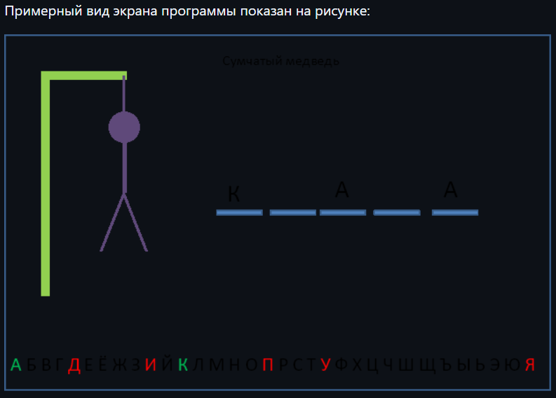

Игра виселица 
Разрешается испольовать графическое API и UI фреймворк

Игрок:
Загадаывает слово, называя его буквам.

Игра:
заканчивается либо победой игрока, либо проигрышем при исчерпании попыток
За каждую неверную букву, отрисовывается новая часть тела висельника
При правильно отгаднной букве показываются всё её вхождения в слово
Выбор букв нажатием мыши по букве
Должно показываться сообщение о проигрыше/выигрыше.
Правильно угадынные буквы отмечаются зелёным, неправильно - красным
Уже выбранные буквы не должны откликаться на действия игрока
Слова и задания должны загружаться программой из внешнего текстового файла
Слова предлагаются игроку случайным образом

Висельник:
веревка, голова, тело, нога, нога, рука, рука

